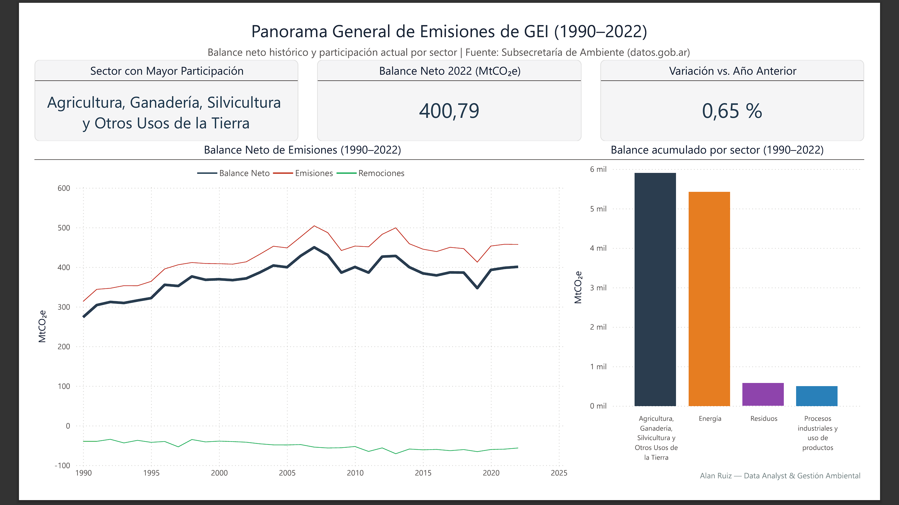
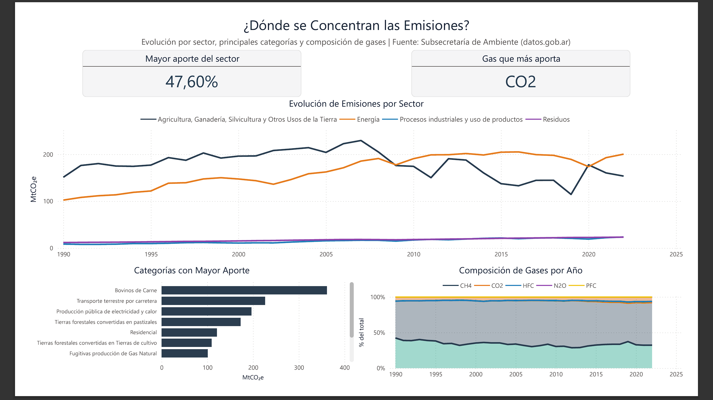
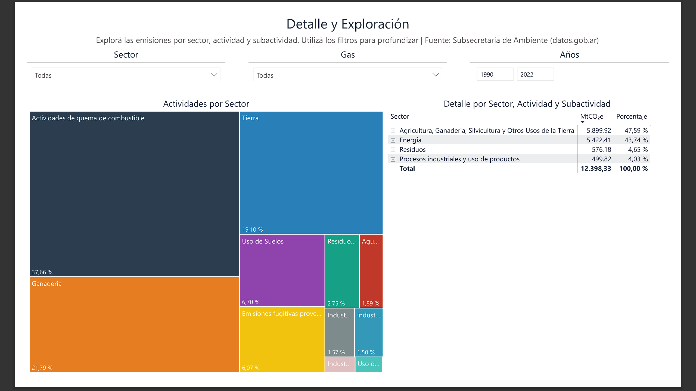
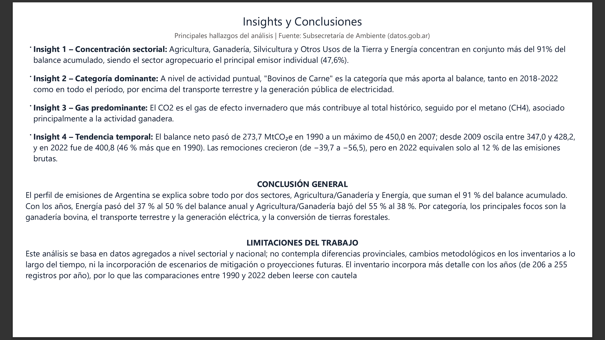

# 🌍 Emisiones de Gases de Efecto Invernadero en Argentina
### Análisis de datos end-to-end: Python + SQL + Power BI

---

## 📌 Descripción

Este proyecto analiza las emisiones y remociones de gases de efecto invernadero (GEI) de Argentina entre 1990 y 2022, e identifica qué sectores, actividades y gases pesan más en el balance nacional.

Se implementa un pipeline completo de datos (**end-to-end**) que incluye:

- Limpieza y exploración de los datos (Python)
- Modelado relacional y vistas analíticas (SQLite)
- Visualización e interpretación (Power BI)

El enfoque combina herramientas de ciencia de datos con criterios de gestión ambiental para generar información útil para el análisis de política climática.

---

## 📈 Resultados principales

- Agricultura, Ganadería, Silvicultura y Otros Usos de la Tierra y Energía concentran el 91,3 % del balance acumulado (47,6 % y 43,7 %).
- El balance neto pasó de 273,7 MtCO₂e en 1990 a 400,8 en 2022 (46 % más), con un máximo de 450,0 en 2007. Desde 2009 oscila entre 347,0 y 428,2.
- Energía fue el sector que más creció: pasó del 37 % al 50 % del balance anual, mientras Agricultura y Ganadería bajó del 55 % al 38 %.
- El CO₂ es el gas de mayor peso (60,3 % del balance acumulado), seguido por el CH₄ (33,8 %), que viene sobre todo de la ganadería.
- "Bovinos de Carne" es la categoría individual de mayor aporte, tanto en 2018-2022 como en todo el período.
- Las remociones crecieron (de −39,7 a −56,5 MtCO₂e), pero en 2022 equivalen al 12 % de las emisiones brutas.

---

## 🎯 Objetivos

- Analizar la evolución histórica del balance de emisiones y remociones (1990–2022)
- Identificar los sectores y actividades con mayor participación
- Evaluar el peso de cada gas y cómo cambió su composición
- Explorar el detalle sectorial (sector → actividad → subactividad)
- Diseñar un dashboard interactivo para el análisis en BI

---

## 🔄 Metodología

**1. Limpieza y exploración (Python, `notebook/01_exploracion_limpieza.ipynb`)**
- Auditoría del dataset: dimensiones, tipos, nulos y estructura jerárquica
- Normalización de texto y eliminación de 41 duplicados exactos (de 7.778 a 7.737 registros)
- Clasificación de los registros en emisión, remoción o sin emisión/remoción (`tipo_de_registro`)
- Exploración por sector, gas, actividad y categoría

**2. Modelado de datos (SQLite, `notebook/02_modelado_sql.ipynb`)**
- Esquema en estrella: `fact_emisiones`, `dim_sector` y `dim_gas`
- Siete vistas analíticas con CTEs y funciones de ventana (`LAG`, `RANK`, `SUM() OVER`)
- Control de cada vista contra un cálculo independiente en pandas
- Exportación a CSV para Power BI

**3. Visualización (Power BI)**
- Dashboard interactivo de cuatro páginas, con medidas DAX
- Análisis por sector, actividad y gas, con filtros para explorar el detalle

---

## 📊 Dashboard (Power BI)

El dashboard se estructura en cuatro páginas:

- **Panorama general**
- **Concentración por sector y gas**
- **Detalle y exploración**
- **Insights y conclusiones**

También está disponible en PDF: [`dashboard/reporte-dashboard-GEI.pdf`](dashboard/reporte-dashboard-GEI.pdf).

### 🖼️ Visualizaciones

#### Panorama general


#### Concentración de emisiones


#### Detalle y exploración


#### Insights


---

## 🧠 Insights clave

- El perfil de emisiones argentino se explica sobre todo por dos sectores: Agricultura/Ganadería y Energía.
- A nivel de categoría, los principales focos son la ganadería bovina, el transporte terrestre y la generación eléctrica, y la conversión de tierras forestales.
- El CO₂ predomina en el balance, seguido por el metano asociado a la ganadería.
- Tras un máximo en 2007, el balance oscila sin una reducción sostenida, y las remociones compensan solo una parte menor de las emisiones.

---

## 🗂️ Fuente de los datos

- **Fuente:** Subsecretaría de Ambiente, *Emisiones de gases de efecto invernadero*, recurso [Inventario de GEI – Datos totales. Periodo 1990-2022](https://datos.gob.ar/dataset/emisiones-de-gases-de-efecto-invernadero/resource/21116ef2-0a55-5e43-a761-99bd45594b57), publicado en datos.gob.ar.
- **Licencia de los datos:** Creative Commons Attribution 4.0.
- **Unidades:** la columna original se llama `valor_en_toneladas_de_co2e`, pero las magnitudes (un balance anual de entre 274 y 450) indican que los valores están en millones de toneladas de CO₂ equivalente (MtCO₂e). Así se interpretan en todo el proyecto. Los nombres de columna conservan `tco2e` para no romper el modelo del dashboard.

---

## ⚠️ Limitaciones

- Datos agregados a nivel sectorial y nacional, sin diferencias provinciales.
- El inventario incorpora más detalle con los años (de 206 a 255 registros por año), por lo que las comparaciones entre 1990 y 2022 deben leerse con cautela.
- Las 41 filas idénticas que se eliminaron suman 0,15 MtCO₂e sobre un total de 12.398,33. Es una diferencia mínima, pero puede tratarse de compuestos distintos con el mismo valor redondeado.
- No se incorporan escenarios de mitigación ni proyecciones futuras.

---

## 🚀 Cómo reproducirlo

Requiere Python 3.14.0 (la versión con la que se desarrolló) y Power BI Desktop solo para abrir el `.pbix`.

```bash
git clone https://github.com/alandruiz/emisiones-gei-argentina.git
cd emisiones-gei-argentina

python -m venv .venv
.venv\Scripts\activate          # en macOS/Linux: source .venv/bin/activate
pip install -r requirements.txt

jupyter lab
```

Abrí los notebooks desde la carpeta `notebook/` y ejecutalos en orden (*Restart & Run All*):

1. `01_exploracion_limpieza.ipynb` lee `data/raw/` y guarda el dataset limpio en `data/processed/`.
2. `02_modelado_sql.ipynb` crea la base `sql/proyecto_gei.db` y exporta las tablas y vistas a `data/interim/`, que son las que importa Power BI.

Si Power BI pide la ubicación de los datos al abrir el dashboard, hay que apuntarla a `data/interim/`.

---

## 📁 Estructura del repositorio

```
emisiones-gei-argentina/
├── dashboard/   dashboard de Power BI (.pbix) y su versión en PDF
├── data/
│   ├── raw/         dato original, sin modificar
│   ├── interim/     tablas y vistas exportadas para Power BI
│   └── processed/   dataset limpio
├── images/      capturas del dashboard
├── notebook/    01 limpieza y exploración, 02 modelado SQL
├── sql/         base SQLite (proyecto_gei.db)
├── LICENSE
├── readme.md
└── requirements.txt
```

---

## 💡 Próximos pasos

- Incorporar datos posteriores a 2022 a medida que se publiquen
- Comparar el balance neto contra las metas de la Contribución Nacionalmente Determinada (NDC) de Argentina
- Automatizar el pipeline de datos
- Publicar el dashboard en línea

---

## 📄 Licencia

El código se publica bajo licencia MIT (ver [`LICENSE`](LICENSE)). Los datos conservan la licencia CC BY 4.0 de su fuente.

---

## 👤 Autor

**Alan Ruiz** — Data Analyst & Gestión Ambiental

- [LinkedIn](https://www.linkedin.com/in/alandruiz/)
- [GitHub](https://github.com/alandruiz/emisiones-gei-argentina)
